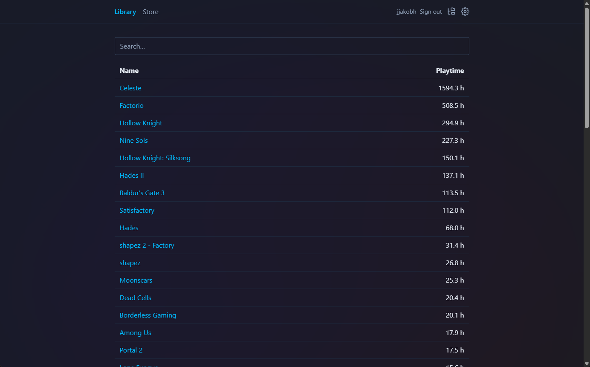
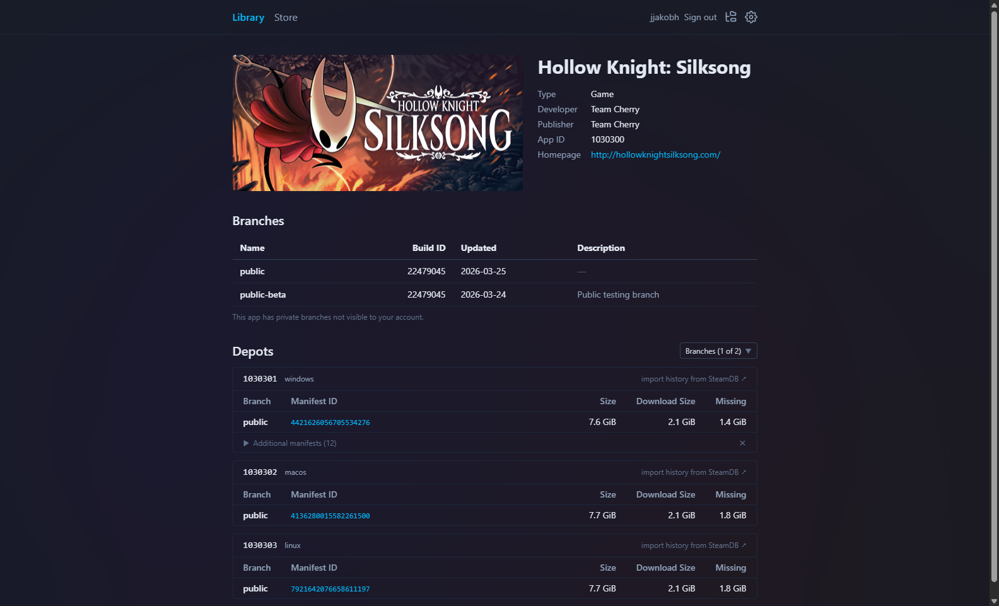
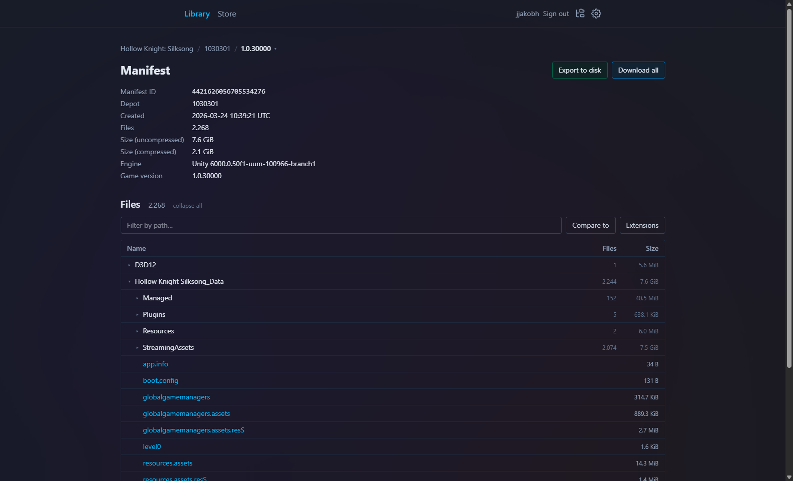
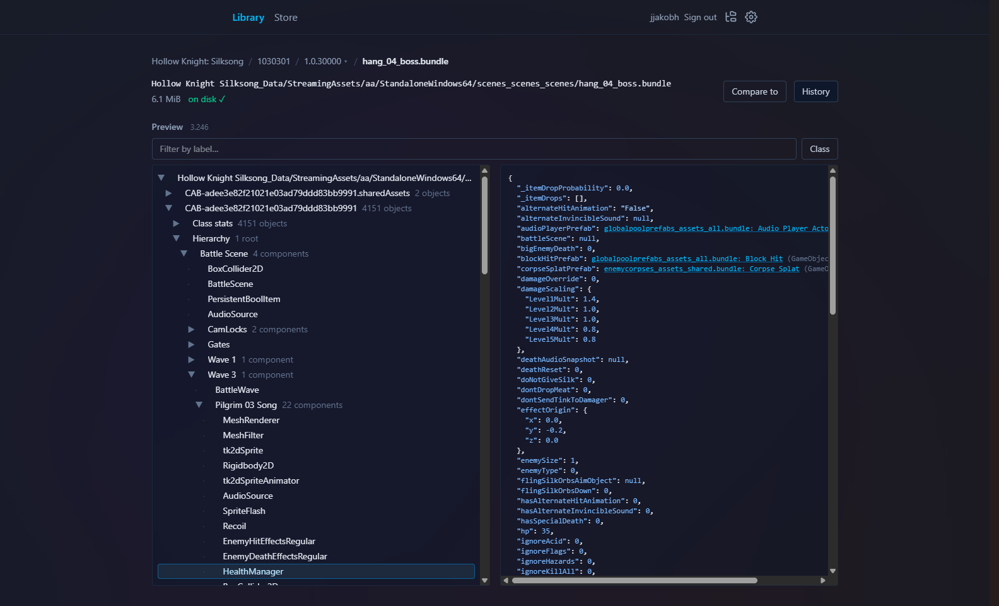
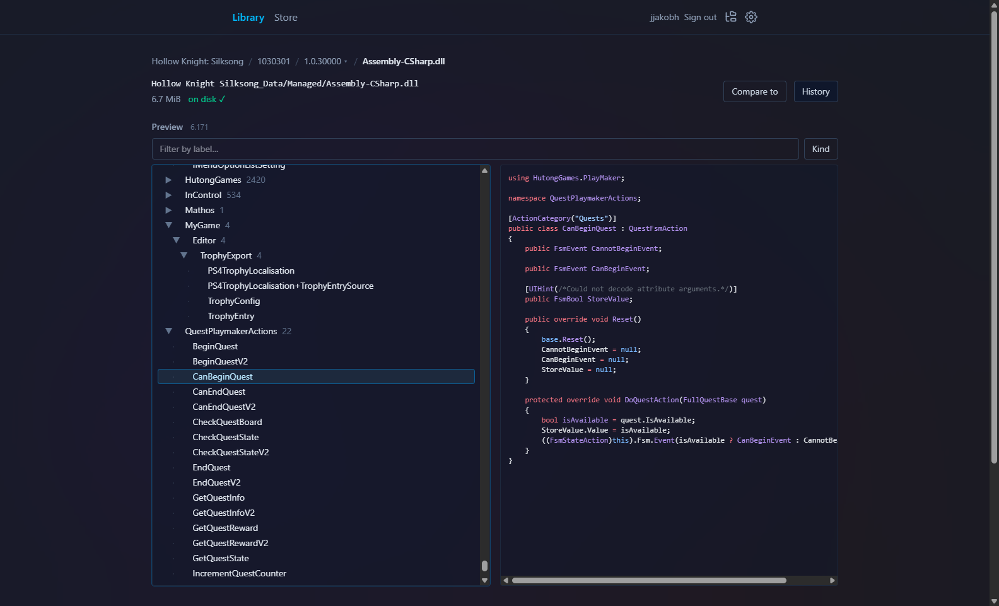
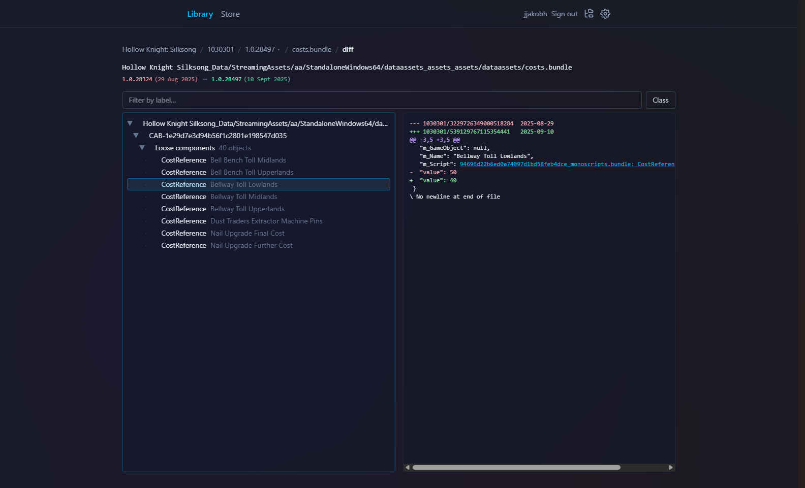
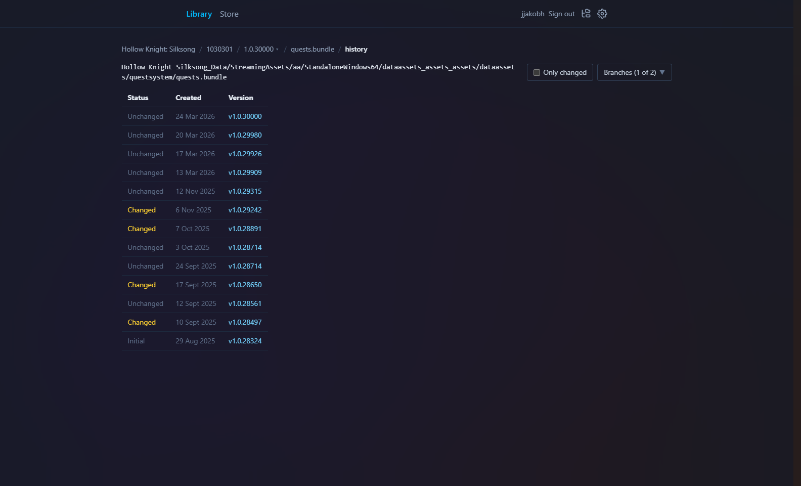
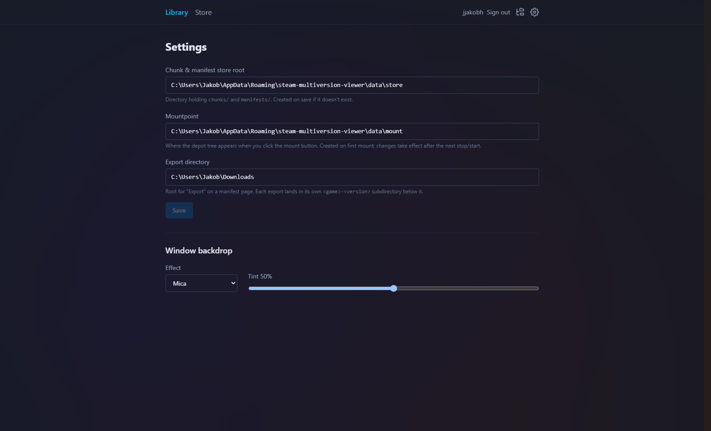
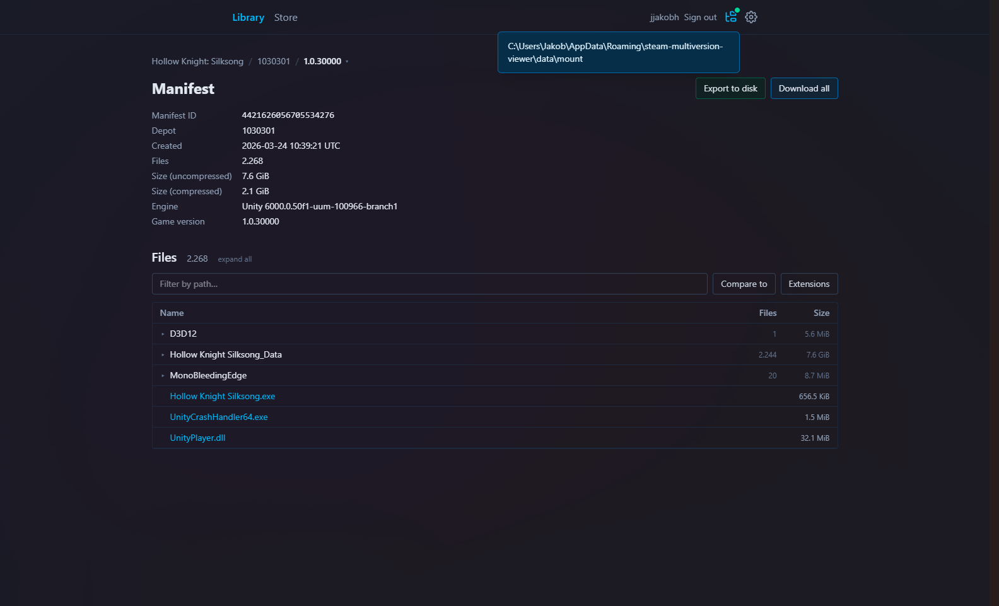
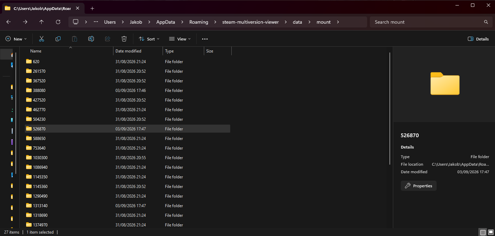

# steam-multiversion-viewer

A tool for viewing contents of steam games at various game versions, including deep introspection and comparison.

## Features

- Browse depots, branches and manifests of your steam apps
- Inspect individual files
  - including structured views into Unity files and DLLs
- Compare changes across manifest versions
- Mount the entire history of your steam library into your filesystem, with lazy downloads

## Screenshots

### Library

### App Overview

### Manifest details

### Structured unity view

### Structured DLL view

### Diff between unity bundles

### Change history of a file

### Settings

### Mount

